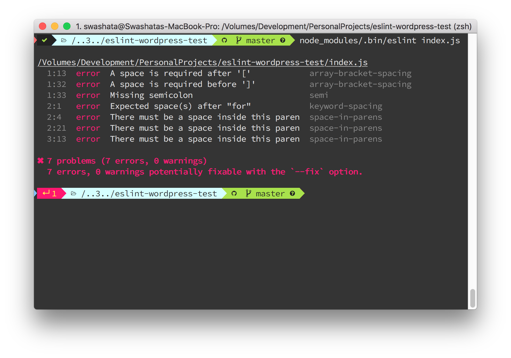

This will guide you through installing ESLint and WordPress Config for your
project and linting files through command line.

> If you are familiar with `Node` and `NPM` skip to the [second part](#2-install-eslint-with-npm).

The guide assumes you are familiar with Terminals and basics of Terminal
commands. Both Linux and OSX comes with their own terminal app which you can
use. For Windows, it is recommended to use [Git Bash](https://git-scm.com/downloads).

If you just want to see a setup, check [this repository](https://github.com/swashata/eslint-wordpress-test).

----------------
## Table of Contents

* [1: Setup Node, NPM and package.json](#1-setup-node-npm-and-packagejson)
	* [1.1: Install Nodejs and NPM](#11-install-nodejs-and-npm)
	* [1.2: Initiate package.json](#12-initiate-packagejson)
	* [Bonus Tip: SCM integration](#bonus-tip-scm-integration)
* [2: Install ESLint with NPM](#2-install-eslint-with-npm)
	* [2.1: Install Dependencies](#21-install-dependencies)
	* [2.2: Initialize ESLint](#22-initialize-eslint)
	* [Bonus Tip: Config inside package.json](#bonus-tip-config-inside-packagejson)
	* [2.3: Tell ESLint to use WordPress Config](#23-tell-eslint-to-use-wordpress-config)
* [3: Lint JavaScript files from CLI](#3-lint-javascript-files-from-cli)
	* [Bonus Tip: Autofix Errors](#bonus-tip-autofix-errors)
* [4: Creating NPM Scripts](#4-creating-npm-scripts)

------------------

## 1: Setup Node, NPM and `package.json`

The [documentation](https://eslint.org/docs/user-guide/getting-started) at ESLint
is really a great place to start, but for new users it can be a little
overwhelming. So just follow this guide through and you will be up and running
in no time.

> Although we can have both local and global installation of ESLint we will
write the guide for local installation as this is very flexible for project
configuration.

### 1.1: Install Nodejs and NPM

If you haven't already installed [Nodejs](https://nodejs.org/en/) install it by
going to the [official website](https://nodejs.org/en/) and downloading and
installing the appropriate package for your Operating System. If you want to
you can also use any [supported package manager](https://nodejs.org/en/download/package-manager/)
for your OS and install through that.

Once installed this will give you both **Nodejs** (A JavaScript Runtime Engine)
and **NPM** (Node Package Manager).

You can open a terminal and type

```bash
node --version
npm --version
```


to confirm you have the latest versions installed.

### 1.2: Initiate `package.json`

Now navigate to the directory where you would like to use ESLint and initialize
`package.json` by running the command below.

```bash
npm init
```


This will ask you a bunch of questions, answer them accordingly and you will find
a `package.json` file in your directory or git repository.

#### Bonus Tip: `SCM` integration

* You should commit the `package.json` and `package-lock.json` file with your SCM.
* You almost never need to commit the `node_modules` directory to your SCM as
anyone in your team can `npm install` to get the dependencies.

Add the following line to your `.gitignore` file (or create one if it does not
exist).

```text
node_modules/
```

A complete list of files for Nodejs environment can be found [here](https://github.com/github/gitignore/blob/master/Node.gitignore).


## 2: Install ESLint with NPM

Now that we have `node` and `npm` setup and configured for our project we need
to add `eslint` and the `eslint-config-wordpress` as our project's development
dependency.

### 2.1: Install Dependencies

Navigate to your Project Directory (where you created the `package.json` file).
```bash
cd ~/myProject
```

Install packages with NPM.
```bash
npm install eslint eslint-config-wordpress -D
```


Now if you check your `package.json` file you will find the packages in your
`devDependencies`.

```json
{
	// ...
	"devDependencies": {
		"eslint": "^4.18.2",
		"eslint-config-wordpress": "^2.0.0"
	}
}
```

### 2.2: Initialize ESLint

To make ESLint work, we need to create an `eslintrc.js` or similar
[configuration](https://eslint.org/docs/user-guide/configuring) file. While we
can create it manually, ESLint does provide an automated process.

From your Project Directory, run the command below.

```bash
node_modules/.bin/eslint --init
```


This will create a `.eslintrc.js` or similar file in your project directory
from where ESLint will find the configuration.

#### Bonus Tip: Config inside `package.json`

If you do not wish to have a separate `.eslintrc.js` file, you can copy the
configuration inside the file inside `eslintConfig` property of `package.json`
file.

```json
{
	// ...
	"devDependencies": {
		"eslint": "^4.18.2",
		"eslint-config-wordpress": "^2.0.0"
	},
	"eslintConfig": {
		"env": {
			"browser": true,
			"es6": true
		},
		"extends": "eslint:recommended",
		"parserOptions": {
			"ecmaFeatures": {
				"experimentalObjectRestSpread": true
			},
			"sourceType": "module"
		},
		"rules": {
			"indent": [
				"error",
				"tab"
			],
			"linebreak-style": [
				"error",
				"unix"
			],
			"quotes": [
				"error",
				"single"
			],
			"semi": [
				"error",
				"always"
			]
		}
	}
}
```

### 2.3: Tell ESLint to use WordPress Config

Now with everything installed, we need to tell ESLint specifically to use
`wordpress` config. Note that right now, in our ESLint config, we have

```json
{
	// ...
	"extends": "eslint:recommended",
	// ...
}
```

Change it to

```json
{
	// ...
	"extends": "wordpress",
	// ...
}
```

And you are all set.

## 3: Lint JavaScript files from CLI

Now that we are all setup, it is time to Lint our code.

Say you have a file inside your Project Directory called `bad-code.js`
with following code.

```js
var myVar = ['I', 'am', 'array']
for(const i of myVar) {
	console.log(myVar[i]);
}
```

Now to lint it, from your terminal type

```bash
node_modules/.bin/eslint bad-code.js
```

And see all the error and warning output.



#### Bonus Tip: Autofix Errors

Now if you want, you can autofix most of the bad codes with a `--fix` option.

Simply from your terminal, run again

```bash
node_modules/.bin/eslint bad-code.js --fix
```

and see the code getting converted into

```js
var myVar = [ 'I', 'am', 'array' ];
for ( const i of myVar ) {
	console.log( myVar[i] );
}
```

## 4: Creating NPM Scripts

Typing the commands can be a bit overwhelming. Luckily we have an option called
[`npm-scripts`](https://docs.npmjs.com/misc/scripts). Edit your `package.json`
file to include the following directives.

```json
{
	// ...
	"scripts": {
	// ...
		"eslint": "eslint *.js",
		"eslintfix": "eslint *.js --fix"
	},
	// ...
}

```


Now you can run

```bash
npm run-script eslint
```

to lint all `*.js` files at once and

```bash
npm run-script eslintfix
```

to fix the errors.
