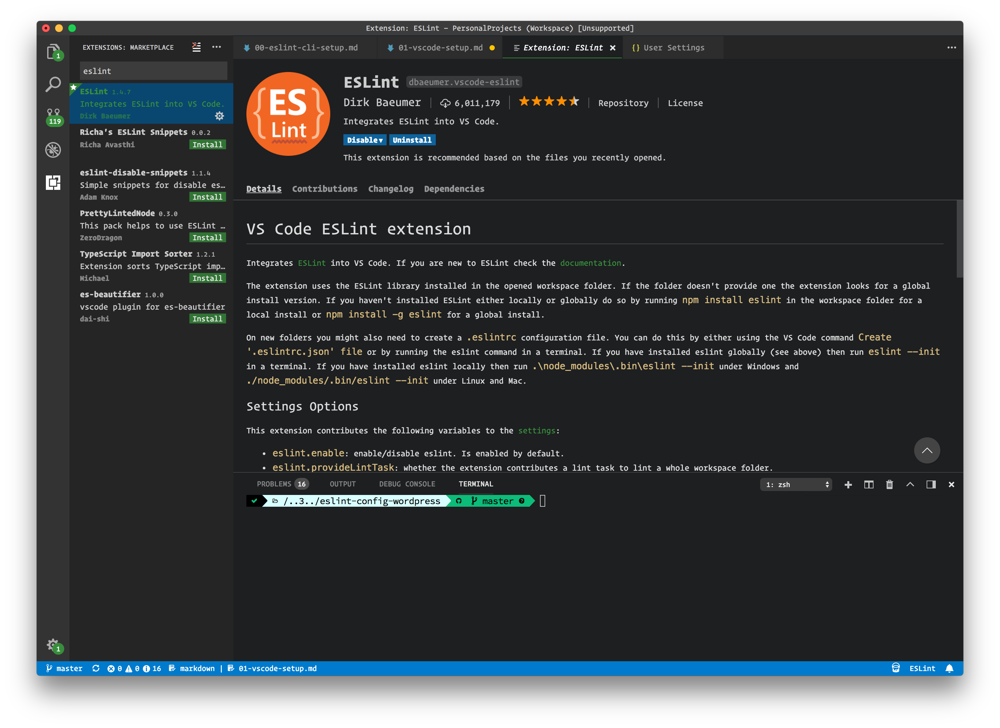
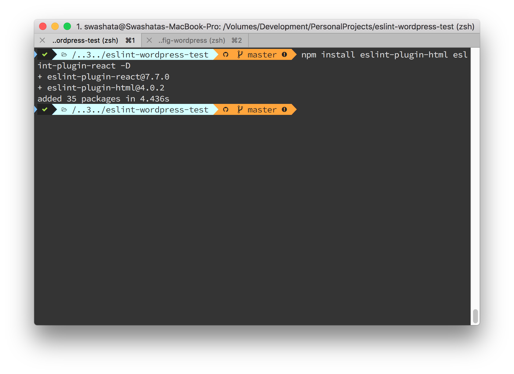
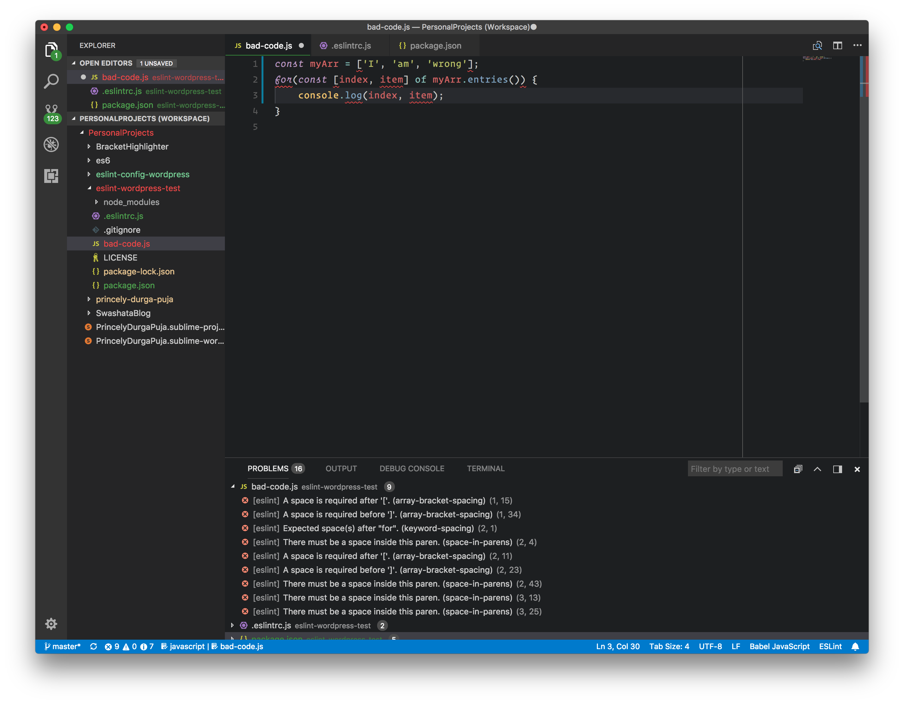

This will guide you to use ESLint within [VSCode](https://code.visualstudio.com/)
(A lightweight IDE) with `eslint-config-wordpress` settings.

--------

## Table of Contents

* [1: Install ESLint VSCode Extension](#1-install-eslint-vscode-extension)
* [2: Enable VSCode config](#2-enable-vscode-config)
	* [2.1: Edit VSCode User Settings](#21-edit-vscode-user-settings)
	* [2.2: Install Additional ESLint Plugins](#22-install-additional-eslint-plugins)
	* [Bonus Tip: Using Multiple Config](#bonus-tip-using-multiple-config)
* [3: Autofix js files on save](#3-autofix-js-files-on-save)
	* [Bonus Tip: editor.formatOnSave](#bonus-tip-editorformatonsave)
* [4: Bonus .eslintrc.js config file](#4-bonus-eslintrcjs-config-file)

--------

## 1: Install ESLint VSCode Extension

For ESLint to work inside VSCode, we need the [ESLint VSCode Extension](https://marketplace.visualstudio.com/items?itemName=dbaeumer.vscode-eslint).

Go to the link above while VSCode is open and click the `Install` button.
The editor will prompt you to install the extension.

Alternatively, you can also click on the Extension icon under VSCode and search
for `ESLint` by the author `Dirk Baeumar`.



The best thing about this extension is that it will first try to use local `ESLint`
and if not found, then it will try for globally installed `ESLint`.

## 2: Enable VSCode config

Once ESLint is installed reload or restart VSCode to get it configured. Do note
that this guide assumes

1. You are installing `ESLint` locally in your Package Directory with `npm` or
`yarn`. If not, go through [this guide](00-eslint-cli-setup.md) first.
2. The same Package Directory is configured as
[VSCode Workspace](https://code.visualstudio.com/docs/editor/multi-root-workspaces).
3. Within your project configuration, either through `package.json` or `.eslintrc.js`
file, you have set `wordpress` as the `"extends"` option of ESLint.

```js
{
	...
	"extends": "wordpress",
	...
}
```

### 2.1: Edit VSCode User Settings

From VSCode open your `User Settings`
(<kbd>⌘</kbd>+<kbd>,</kbd> for mac, <kbd>Ctrl</kbd>+<kbd>,</kbd> for rest).

Now add/edit the following configuration to your `User Settings`.

```json
"eslint.enable": true,
"eslint.alwaysShowStatus": true,
"eslint.validate": [
	"javascript",
	"javascriptreact",
	"html"
],
```

What it essentially does is, enables `eslint` inside VSCode and ESLints `.js`,
`.html` and `.jsx` files. Which files get "ESLint"ed is configured through
`eslint.validate` option. Here you simply put [language identifier](https://code.visualstudio.com/docs/languages/overview#_language-id).

If you want to enable ESLint inside `markdown` then simply add `"markdown"` in
the `"eslint.validate"` array.

```json
"eslint.enable": true,
"eslint.alwaysShowStatus": true,
"eslint.validate": [
	"javascript",
	"javascriptreact",
	"html",
	"markdown"
],
```

But ESLinting files other than `.js` requires additional plugins which we will
discuss now.

### 2.2: Install Additional ESLint Plugins

ESLint can lint `.js` files fine right out of the box. But when we are talking
about editor integration, we expect to link `JavaScript` inside `.html` and
possibly `.jsx` files too. For this, we need to add a few plugins. In this
guide, we will see how to use
[`eslint-plugin-html`](https://www.npmjs.com/package/eslint-plugin-html) and
[`eslint-plugin-react`](https://www.npmjs.com/package/eslint-plugin-react) to
lint `.html` and `.jsx` files. You can find similar plugins and configuration
for [`markdown`](https://www.npmjs.com/package/eslint-plugin-markdown) too.

First install the needed plugins as `devDependencies` with `npm`.

```bash
npm install eslint-plugin-html eslint-plugin-react -D
```



Now enable the plugins inside your `.eslintrc.js` file or `package.json` file.

```json
{
	...
	"plugins": [
		"html",
		"react"
	],
	...
}
```

Some plugins, like `eslint-plugin-react` requires additional settings. Check the
guide from the plugin page and enabled them too.

```json
{
	...
	"parserOptions": {
		"ecmaFeatures": {
			"jsx": true // required by eslint-plugin-react
		},
		"sourceType": "module"
	},
	...
}
```

Now when you code inside VSCode, the ESLint extension will show the errors
right away.



#### Bonus Tip: Using Multiple Config

Sometimes you may also need to have presets from other providers which `wordpress`
doesn't use or interferes with right now. In this scenario, you can use the
`"extends"` option inside `.eslintrc.js` or `package.json` file to extend over
multiple configurations.

For example, with the `eslint-plugin-react` plugin if we want to use the
settings provided by the plugin and `wordpress` together, we will define it like

```json
{
	...
	"extends": [
		"plugin:react/recommended",
		"wordpress"
	]
	...
}
```

Having the `wordpress` config at the end of the array ensures that we always
adhere to WordPress Coding Standards.

## 3: Autofix `js` files on save

Sometimes when working with your personal projects, it is easier to automatically
perform fixes when saving the file in VSCode. The ESLint extension provides an
option to do that.

**You should not have this enabled while editing WordPress Core Files. It is
[not encouraged](https://make.wordpress.org/core/handbook/best-practices/coding-standards/javascript/#code-refactoring).**

Open `User Settings` (<kbd>⌘</kbd>+<kbd>,</kbd> for mac, <kbd>Ctrl</kbd>+<kbd>,</kbd> for rest)
and add the following configuration.

```json
"eslint.autoFixOnSave": true
```

Now if you write bad code like this

```js
const myArr = ['I', 'am', 'wrong'];
for(const [index, item] of myArr.entries()) {
	console.log(index, item);
}
```

After just saving the file, it will become this

```js
const myArr = [ 'I', 'am', 'wrong' ];
for ( const [ index, item ] of myArr.entries() ) {
	console.log( index, item );
}
```

### Bonus Tip: `editor.formatOnSave`
If you have `"editor.formatOnSave": true` then you need to disable it for
javascript language and enable `"eslint.autoFixOnSave"`.

```json
{
	...
	"editor.formatOnSave": true,
	"[javascript]": {
		"editor.formatOnSave": false
	},
	"[javascriptreact]": {
		"editor.formatOnSave": false
	},
	"eslint.autoFixOnSave": true,
	...
}
```

Now this will work as expected on `.js` and `.jsx` files. Do note that autofix
does not yet work with `.html` files.

## 4: Bonus `.eslintrc.js` config file

If you just want to grab a config file that just works right out of the box
then you may use this. Make sure you have `eslint-plugin-html` and `eslint-plugin-react`
as your `devDependencies` inside `package.json` file.

```js
module.exports = {
    "env": {
        "browser": true,
        "es6": true
    },
    "extends": [
        "plugin:react/recommended",
        "wordpress"
    ],
    "parserOptions": {
        "ecmaFeatures": {
            "jsx": true,
            "experimentalObjectRestSpread": true
        },
        "sourceType": "module"
    },
    "plugins": [
        "html",
        "react"
    ],
    "rules": {
        "indent": [
            "error",
            "tab"
        ],
        "linebreak-style": [
            "error",
            "unix"
        ],
        "quotes": [
            "error",
            "single"
        ],
        "semi": [
            "error",
            "always"
        ]
    }
};
```

To see the `package.json` and `.eslintrc.js` file yourself, check [this repository](https://github.com/swashata/eslint-wordpress-test).
